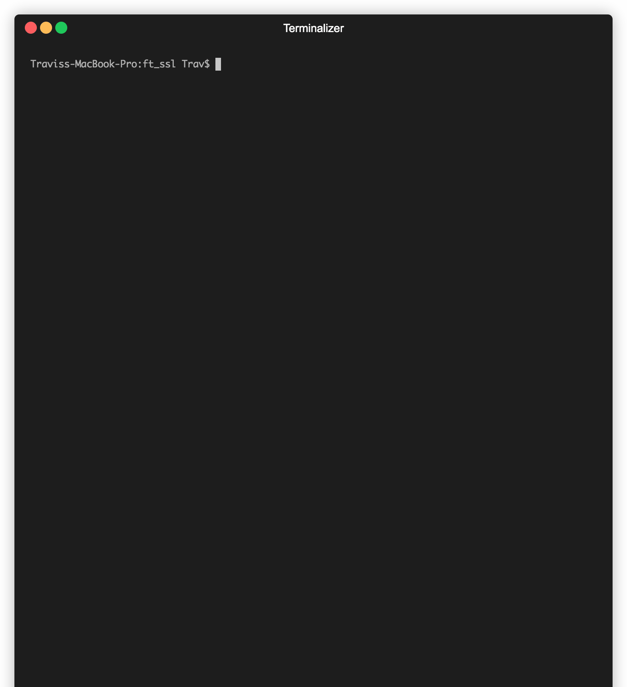

[![Contributors][contributors-shield]][contributors-url]
[![Forks][forks-shield]][forks-url]
[![Stargazers][stars-shield]][stars-url]
[![Issues][issues-shield]][issues-url]
[![MIT License][license-shield]][license-url]
[![LinkedIn][linkedin-shield]][linkedin-url]


<!-- TABLE OF CONTENTS -->
<details open="open">
  <summary>Table of Contents</summary>
  <ol>
    <li>
      <a href="#about-the-project">About The Project</a>
      <ul>
        <li><a href="#built-with">Built With</a></li>
      </ul>
    </li>
    <li>
      <a href="#getting-started">Getting Started</a>
      <ul>
        <li><a href="#prerequisites">Prerequisites</a></li>
        <li><a href="#installation">Installation</a></li>
      </ul>
    </li>
    <li><a href="#usage">Usage</a></li>
    <li><a href="#roadmap">Roadmap</a></li>
    <li><a href="#contributing">Contributing</a></li>
    <li><a href="#license">License</a></li>
    <li><a href="#contact">Contact</a></li>
    <li><a href="#disclaimer">Disclaimer</a></li>
    <li><a href="#references">References</a></li>
  </ol>
</details>


<!-- ABOUT THE PROJECT -->
## About The Project



A miniature implementation of openssl implementing several encryption and hashing algorithms, namely:
* md5
* sha-256
* base64
* des-ecb
* des-cbC
* des-pcbc
* des3-ecb
* des3-cbc
* des3-pcbc
* scrypt


### Built With

`ft_ssl` is developed in C using `gcc`, with no outside dependencies.


<!-- GETTING STARTED -->
## Getting Started


### Prerequisites

No outside dependencies are required, outside of a C compiler and Make.

### Installation

1. Clone the repo
   ```sh
   git clone https://github.com/travmatth/ft_ssl.git
   ```
2. Compile `ft_ssl`
   ```sh
   make
   ```


<!-- USAGE EXAMPLES -->
## Usage


```sh
export DES_KEY="C0FFEE69DEADBEEF"
export DES_IV=0011223344556677

echo "We can encode base64" | ./ft_ssl base64
echo "And decode it" | ./ft_ssl base64 | ./ft_ssl base64 -d
echo "We can encrypt with DES3" |  ./ft_ssl des3 -a -k "$DES_KEY" -v "$DES_IV" -o out.txt
# and decrypt it
./ft_ssl des3 -a -k "$DES_KEY" -v "$DES_IV" -i out.txt -d
./ft_ssl des3 -p "we can also generate secure keys using scrypt"
```


<!-- ROADMAP -->
## Roadmap

See the [open issues](https://github.com/travmatth/ft_ssl/issues) for a list of proposed features (and known issues).


<!-- CONTRIBUTING -->
## Contributing

Contributions are what make the open source community such an amazing place to be learn, inspire, and create. Any contributions you make are **greatly appreciated**.

1. Fork the Project
2. Create your Feature Branch (`git checkout -b feature/AmazingFeature`)
3. Commit your Changes (`git commit -m 'Add some AmazingFeature'`)
4. Push to the Branch (`git push origin feature/AmazingFeature`)
5. Open a Pull Request


<!-- LICENSE -->
## License

Distributed under the MIT License. See `LICENSE` for more information.


<!-- CONTACT -->
## Contact

Travis Matthews

Project Link: [https://github.com/travmatth/ft_ssl](https://github.com/travmatth/ft_ssl)


## Disclaimer
This project was created for educational use ONLY, and is NOT intended for use in secure commincations or production systems.


<!-- ACKNOWLEDGEMENTS -->
## References
* http://page.math.tu-berlin.de/~kant/teaching/hess/krypto-ws2006/des.htm
* https://csrc.nist.gov/csrc/media/publications/fips/81/archive/1980-12-02/documents/fips81.pdf
* https://csrc.nist.gov/csrc/media/publications/fips/46/3/archive/1999-10-25/documents/fips46-3.pdf
* https://crypto.stackexchange.com/questions/9674/how-does-des-decryption-work-is-it-the-same-as-encryption-or-the-reverse
* https://en.wikipedia.org/wiki/DES_supplementary_material
* https://en.wikipedia.org/wiki/S-box
* https://www.di-mgt.com.au/cryptopad.html


<!-- MARKDOWN LINKS & IMAGES -->
<!-- https://www.markdownguide.org/basic-syntax/#reference-style-links -->
[contributors-shield]: https://img.shields.io/github/contributors/travmatth/ft_ssl.svg?style=for-the-badge
[contributors-url]: https://github.com/travmatth/ft_ssl/graphs/contributors
[forks-shield]: https://img.shields.io/github/forks/travmatth/ft_ssl.svg?style=for-the-badge
[forks-url]: https://github.com/travmatth/ft_ssl/network/members
[stars-shield]: https://img.shields.io/github/stars/travmatth/ft_ssl.svg?style=for-the-badge
[stars-url]: https://github.com/travmatth/ft_ssl/stargazers
[issues-shield]: https://img.shields.io/github/issues/travmatth/ft_ssl.svg?style=for-the-badge
[issues-url]: https://github.com/travmatth/ft_ssl/issues
[license-shield]: https://img.shields.io/github/license/travmatth/ft_ssl.svg?style=for-the-badge
[license-url]: https://github.com/travmatth/ft_ssl/blob/master/LICENSE.txt
[linkedin-shield]: https://img.shields.io/badge/-LinkedIn-black.svg?style=for-the-badge&logo=linkedin&colorB=555
[linkedin-url]: https://www.linkedin.com/in/travis-matthews-885228141/
